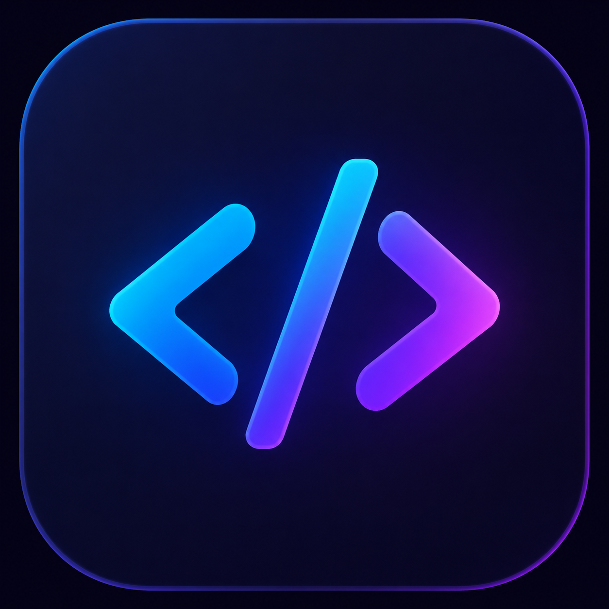
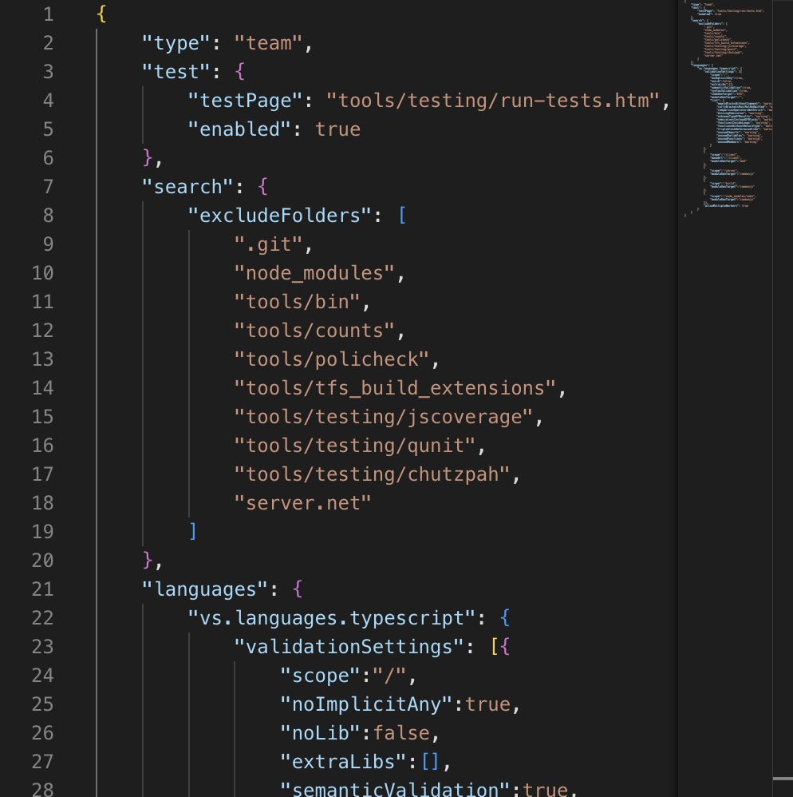

<div align="center">

  

  # Vue3 Vite Monaco Editor

  Code editor component integrating Monaco Editor with Vue 3 + Vite

  [](https://github.com/boommanpro/vue3-vite-monaco-editor/actions/workflows/deploy.yml)
  [](LICENSE)
  [](https://vuejs.org/)
  [](https://vite.dev/)
  [](https://microsoft.github.io/monaco-editor/)

  **English** | 🌐 [中文](README.md)

</div>

## Introduction

Vue3 Vite Monaco Editor is a sample component that integrates [Monaco Editor](https://microsoft.github.io/monaco-editor/) (the core editor of VS Code) into a Vue 3 + Vite project.

The component wraps common Monaco Editor features, supports `v-model` two-way binding, multi-language syntax highlighting, theme switching, and properly configures Web Workers to ensure the editor runs correctly in a Vite environment. Suitable for scenarios that require embedding a code editor in web applications.

## Features

- **v-model Two-way Binding** — External code can get editor content in real-time, and external changes sync to the editor
- **Multi-language Support** — Supports all Monaco languages including JSON, JavaScript, TypeScript, CSS, HTML, etc.
- **Theme Switching** — Supports Monaco built-in themes like `vs-dark`, `vs-light`
- **Web Worker Configuration** — Properly configured EditorWorker, JsonWorker, CssWorker, HtmlWorker, TsWorker
- **Customizable Size** — Flexible editor dimensions via `width` / `height` props

## Demo

Live demo: **https://boommanpro.github.io/vue3-vite-monaco-editor/**



## Tech Stack

| Technology | Description |
| --- | --- |
| Vue 3 | Frontend framework (Composition API) |
| Vite 5 | Build tool and dev server |
| Monaco Editor 0.50 | VS Code core editor |
| Yarn | Package manager |

## Quick Start

### Prerequisites

- Node.js >= 18
- Yarn

### Install Dependencies

```sh
cd console
yarn install
```

### Development

```sh
yarn dev
```

Visit http://localhost:5173 to view the app.

### Build for Production

```sh
yarn build
```

The build output will be in the `console/dist/` directory.

### Preview Production Build

```sh
yarn preview
```

## Component Usage

### Install Monaco Editor

```sh
yarn add monaco-editor@0.50.0
```

### Configure Web Worker

Create `worker.js` to configure language workers:

```js
import * as monaco from 'monaco-editor';
import EditorWorker from 'monaco-editor/esm/vs/editor/editor.worker?worker';
import JsonWorker from 'monaco-editor/esm/vs/language/json/json.worker?worker';
import CssWorker from 'monaco-editor/esm/vs/language/css/css.worker?worker';
import HtmlWorker from 'monaco-editor/esm/vs/language/html/html.worker?worker';
import TsWorker from 'monaco-editor/esm/vs/language/typescript/ts.worker?worker';

self.MonacoEnvironment = {
    getWorker(_, label) {
        if (label === 'json') return new JsonWorker();
        if (label === 'css' || label === 'scss' || label === 'less') return new CssWorker();
        if (label === 'html' || label === 'handlebars' || label === 'razor') return new HtmlWorker();
        if (label === 'typescript' || label === 'javascript') return new TsWorker();
        return new EditorWorker();
    }
};

monaco.languages.typescript.typescriptDefaults.setEagerModelSync(true);
```

Import in `main.js`: `import './worker.js'`

### Use the Component

```vue
<template>
  <monaco-vite :width="500" :height="500" v-model="code" language="json" />
</template>

<script setup>
import { ref } from 'vue'
import MonacoVite from './components/MonacoVite.vue'

const code = ref('{}')
</script>
```

### Component Props

| Prop | Type | Default | Description |
| --- | --- | --- | --- |
| `modelValue` | String | `''` | Editor content, supports v-model |
| `language` | String | `'json'` | Language mode |
| `theme` | String | `'vs-dark'` | Theme |
| `width` | Number | `500` | Width (px) |
| `height` | Number | `500` | Height (px) |

## Deployment

### GitHub Pages

This project is configured with GitHub Actions to automatically deploy to GitHub Pages. Pushing to the `main` branch triggers an automatic build and deployment.

#### Manual Configuration

1. Go to repository **Settings → Pages**
2. Set Source to **GitHub Actions**
3. Push code to the `main` branch, Actions will automatically build and deploy

## License

[MIT](LICENSE)
